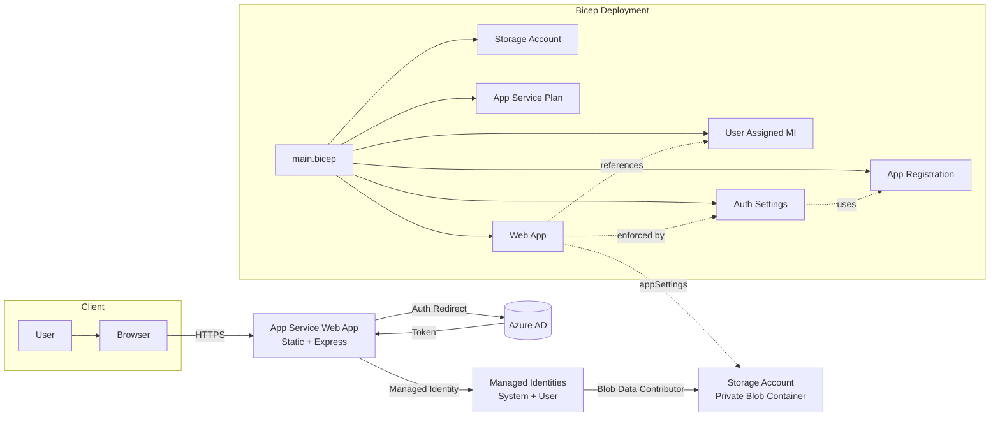

## Azure Simple Example Web App

This project deploys a simple Node.js (Express) file upload web application to Azure App Service (Linux) backed by an Azure Storage Account (Blob) using Managed Identity and protected with Azure Active Directory authentication configured through App Service Authentication ("Easy Auth") and a custom App Registration provisioned via Bicep.

### Key Features
- Node.js 24 LTS runtime on Linux App Service (Express server + static `public/index.html`)
- Secure file uploads to a private Blob container using Managed Identity (`DefaultAzureCredential`)
- Azure AD authentication enforced at the App Service edge (redirect to login)
- Bicep infrastructure using Azure Verified Modules (AVM) for consistency and security
- Least-privilege role assignment (Blob Data Contributor) to Web App and deployer

### Infrastructure Components (Bicep `main.bicep`)
- Storage Account (V2) with private `uploads` container
- App Service Plan (Linux)
- Web App (System + User Assigned Managed Identity)
- User Assigned Managed Identity (federated credential via App Registration module)
- Azure AD Application (App Registration + Federated Identity Credential)
- App Service Auth Settings (authsettingsV2) enforcing Azure AD login

### Application Components (`app/`)
- `server.js`: Express server exposing routes: `/` (static), `/upload`, `/files`, `/health`
- Uses `@azure/storage-blob` and `@azure/identity` for MI-based blob operations
- File validation & size limits (10MB) via `multer`

### Architecture Diagram


### Resource Naming Pattern
Names are suffixed with a 5-char hash for uniqueness:
`st{appName}{suffix}`, `asp-{appName}-{suffix}`, `app-{appName}-{suffix}`, `uami-{appName}-{suffix}`.

### Bicep Parameters
| Name                | Description                          | Default        |
| ------------------- | ------------------------------------ | -------------- |
| `appName`           | Base name for resources (<=14 chars) | (required)     |
| `appServicePlanSku` | App Service Plan SKU                 | `B1`           |
| `storageSku`        | Storage SKU                          | `Standard_LRS` |

### Outputs
- `webAppUrl`: Public HTTPS endpoint of the deployed Web App.

### Prerequisites
- Azure CLI `az` logged in (`az login`)
- Sufficient rights to create App Service, Storage, App Registration (Graph RBAC)
- Resource group created (or create one)

### Deployment Steps (CLI)
```pwsh
# Variables
$RG="my-rg"            # existing resource group
$LOCATION="westeurope" # choose preferred region
$APPNAME="magicfiles"  # <=14 chars

# Create resource group if needed
az group create -n $RG -l $LOCATION

# Deploy Bicep (using local parameters file if desired)
az deployment group create \n  -g $RG \n  -f infra/main.bicep \n  -p appName=$APPNAME

# Retrieve Web App URL
az deployment group show -g $RG -n main --query properties.outputs.webAppUrl.value -o tsv
```

### Local Development
```pwsh
cd app
npm install
npm run start  # or npm run dev
```
Set environment variables for local testing (optional) in a `.env` file:
```
AZURE_STORAGE_ACCOUNT_NAME=yourdevstorage
AZURE_STORAGE_CONTAINER_NAME=uploads
```
For local runs with Managed Identity you typically test inside the Azure environment; locally you may use a Service Principal or `az login` + `AzureDeveloperCliCredential` as needed (not included here for brevity).

### Authentication Flow
1. Unauthenticated request hits Web App
2. App Service Auth redirects to Azure AD login
3. After login, token is injected; backend endpoints are protected
4. Express server uses Managed Identity (via `DefaultAzureCredential`) to access Blob Storage without secrets

### Security Considerations
- Public access to blobs disabled; uploads remain private
- TLS 1.2 enforced; HTTPS only
- FTPS disabled
- Managed Identity avoids storing secrets
- Role Assignments limited to Blob Data Contributor

### Extensibility Ideas
- Add listing & secure download with SAS tokens
- Integrate application insights for monitoring
- Add CI/CD via GitHub Actions or `azd`

### Troubleshooting
- 403 after login: Ensure Auth settings deployed and App Registration redirect URI matches `/.auth/login/aad/callback`.
- Upload fails: Confirm `AZURE_STORAGE_ACCOUNT_NAME` app setting and role assignment propagation (can take a minute).
- Missing identity: Check Web App has both system and user assigned identities.

### License
MIT License (see `LICENSE`).

---
Generated architecture documentation with Mermaid for clarity.
