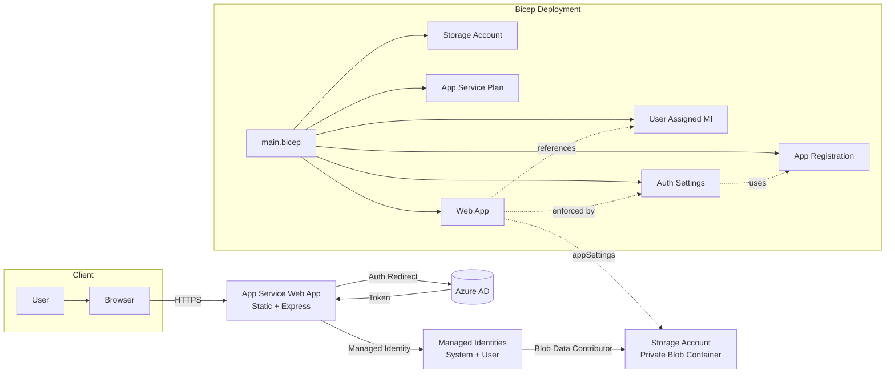

## Azure Simple Example Web App

This project deploys a simple Node.js (Express) file upload web application to Azure App Service (Linux) backed by an Azure Storage Account (Blob) using Managed Identity and protected with Azure Active Directory authentication configured through App Service Authentication ("Easy Auth") and a custom App Registration provisioned via Bicep.

### Key Features
- Node.js 24 LTS runtime on Linux App Service (Express server + static `public/index.html`)
- Secure file uploads to a private Blob container using Managed Identity (`DefaultAzureCredential`)
- Azure AD authentication enforced at the App Service edge (redirect to login)
- Bicep infrastructure using Azure Verified Modules (AVM) for consistency and security
- Least-privilege role assignment (Blob Data Contributor) to Web App and deployer

### Infrastructure Components (Bicep `main.bicep`)
- Storage Account (V2) with private `uploads` container
- App Service Plan (Linux)
- Web App (System + User Assigned Managed Identity)
- User Assigned Managed Identity (federated credential via App Registration module)
- Azure AD Application (App Registration + Federated Identity Credential)
- App Service Auth Settings (authsettingsV2) enforcing Azure AD login

### Application Components (`app/`)
- `server.js`: Express server with REST API endpoints:
  - `GET /` - Serves the main web interface
  - `POST /api/upload` - Upload files to blob storage
  - `GET /api/files` - List all files in the container
  - `GET /api/download/:filename` - Download a specific file
  - `DELETE /api/files/:filename` - Delete a file
  - `GET /api/health` - Health check endpoint
- `public/index.html`: Modern, responsive UI with:
  - Drag-and-drop file upload
  - File listing with icons and metadata
  - Download and delete functionality
  - Real-time status messages
  - Mobile-responsive design
- Uses `@azure/storage-blob` and `@azure/identity` for MI-based blob operations
- File validation & size limits (100MB) via `multer`
- System-assigned managed identity authenticated via `DefaultAzureCredential`

### Architecture Diagram


### Resource Naming Pattern
Names are suffixed with a 5-char hash for uniqueness:
`st{appName}{suffix}`, `asp-{appName}-{suffix}`, `app-{appName}-{suffix}`, `uami-{appName}-{suffix}`.

### Bicep Parameters
| Name                | Description                          | Default        | Range |
| ------------------- | ------------------------------------ | -------------- | ----- |
| `appName`           | Base name for resources (<=14 chars) | (required)     | -     |
| `appServicePlanSku` | App Service Plan SKU                 | `B1`           | -     |
| `storageSku`        | Storage SKU                          | `Standard_LRS` | -     |
| `maxFileSizeMB`     | Maximum file size for uploads (MB)   | `100`          | 1-500 |

### Outputs
- `webAppUrl`: Public HTTPS endpoint of the deployed Web App.

### Prerequisites
- Azure CLI `az` logged in (`az login`)
- Sufficient rights to create App Service, Storage, App Registration (Graph RBAC)
- Resource group created (or create one)

### Deployment Steps (CLI)
```pwsh
# Variables
$RG="my-rg"            # existing resource group
$LOCATION="westeurope" # choose preferred region
$APPNAME="magicfiles"  # <=14 chars

# Create resource group if needed
az group create -n $RG -l $LOCATION

# Deploy Bicep (using local parameters file if desired)
az deployment group create \n  -g $RG \n  -f infra/main.bicep \n  -p appName=$APPNAME

# Optional: Deploy with custom max file size (e.g., 200MB)
az deployment group create \n  -g $RG \n  -f infra/main.bicep \n  -p appName=$APPNAME maxFileSizeMB=200

# Retrieve Web App URL
az deployment group show -g $RG -n main --query properties.outputs.webAppUrl.value -o tsv
```

### Local Development
```pwsh
cd app
npm install
npm start
```
The server will start on port 8080 by default.

Set environment variables for local testing (optional) in a `.env` file:
```
AZURE_STORAGE_ACCOUNT_NAME=yourdevstorage
AZURE_STORAGE_CONTAINER_NAME=uploads
MAX_FILE_SIZE_MB=100
PORT=8080
```
For local runs with Managed Identity you typically test inside the Azure environment; locally you may use a Service Principal or `az login` + `DefaultAzureCredential` which will automatically detect your Azure CLI credentials.

### Authentication Flow
1. Unauthenticated request hits Web App
2. App Service Auth redirects to Azure AD login
3. After login, token is injected; backend endpoints are protected
4. Express server uses Managed Identity (via `DefaultAzureCredential`) to access Blob Storage without secrets

### Security Considerations
- Public access to blobs disabled; uploads remain private
- TLS 1.2 enforced; HTTPS only
- FTPS disabled
- Managed Identity avoids storing secrets
- Role Assignments limited to Blob Data Contributor

### Deploying the Application Code
After deploying the infrastructure, deploy the application code:

```pwsh
# Option 1: Using Azure CLI (Local Git)
cd app
az webapp up --name <your-web-app-name> --resource-group $RG

# Option 2: Using Git deployment (recommended)
# 1. Commit your code to the repository
git add .
git commit -m "Add web application"
git push

# 2. Set up deployment from your repo
az webapp deployment source config --name <your-web-app-name> \
  --resource-group $RG \
  --repo-url <your-repo-url> \
  --branch main \
  --manual-integration

# Option 3: Using VS Code Azure App Service extension
# Install the Azure App Service extension and right-click on the app folder to deploy
```

### Testing the Application
1. Navigate to the Web App URL (output from deployment)
2. Sign in with your Azure AD credentials
3. You'll see the MagicFiles interface
4. Upload files by:
   - Dragging and dropping onto the upload area
   - Clicking "Choose File" and selecting a file
5. View uploaded files in the grid below
6. Download or delete files using the action buttons

### Troubleshooting
- **401 Unauthorized when accessing blob storage**: Ensure the Web App's system-assigned managed identity has the "Storage Blob Data Contributor" role on the storage account
- **Files not appearing**: Check the Azure Portal to verify files are in the container
- **Upload fails**: Check file size limit (100MB) and ensure container exists
- **Cannot sign in**: Verify the App Registration is configured correctly with the Web App URL as a redirect URI

### Extensibility Ideas
- Add file type restrictions and virus scanning
- Implement file sharing with SAS tokens
- Add file versioning and metadata
- Integrate Application Insights for monitoring
- Add search and filtering capabilities
- Implement folder/directory structure
- Add CI/CD via GitHub Actions or `azd`

### Troubleshooting
- 403 after login: Ensure Auth settings deployed and App Registration redirect URI matches `/.auth/login/aad/callback`.
- Upload fails: Confirm `AZURE_STORAGE_ACCOUNT_NAME` app setting and role assignment propagation (can take a minute).
- Missing identity: Check Web App has both system and user assigned identities.

### License
MIT License (see `LICENSE`).

---
Generated architecture documentation with Mermaid for clarity.
